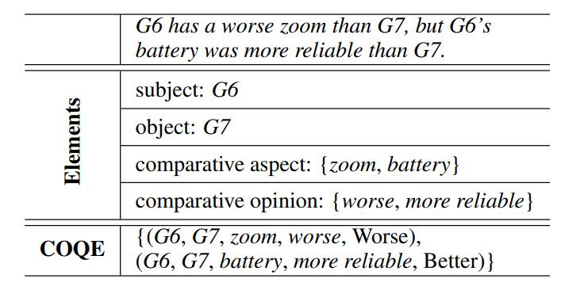
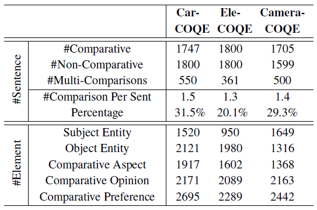
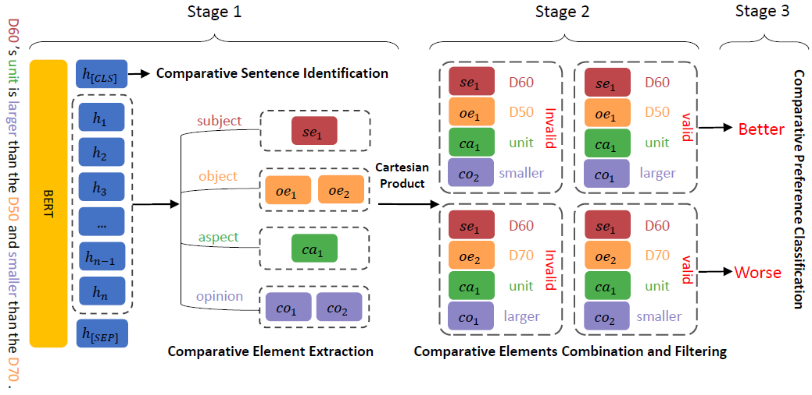
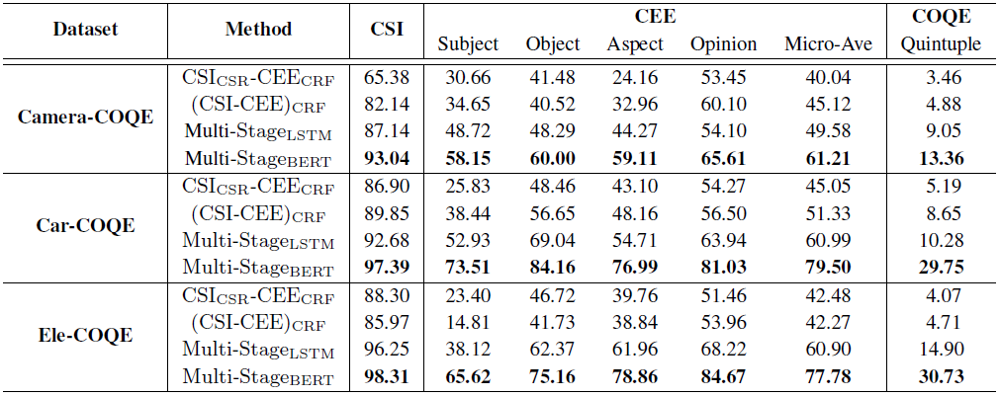
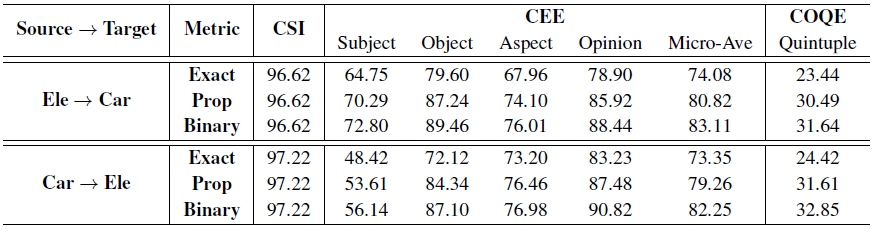

<!-- # ACOS
We are making the final preparations for the release of our data and code. They will be coming soon. -->

# Comparative Opinion Quintuple Extraction from Product Reviews

This repo contains the data sets and source code of our paper:

Ziheng Liu, Rui Xia, and Jianfei Yu. Comparative Opinion Quintuple Extraction from Product Reviews. EMNLP 2021. [[pdf]](https://aclanthology.org/2021.emnlp-main.322.pdf)

- We propose a new Comparative Opinion Quintuple Extraction (COQE) task, aiming to extract all the comparative quintuples from each review sentence;
- We construct three new datasets for the task, on the basis of the existing comparative opinion mining corpora;
- We benchmark the task by proposing a multistage neural network approach which significantly outperforms baseline systems extended from traditional methods.

## Task

The Comparative Opinion Quintuple Extraction (COQE) is to first identify whether it is a comparative sentences, and then extract the set of quintuples (sub, obj , ca, co, cp) if it is a comparative sentence.

<p align="center">

</p>
<!--  -->

## Datasets

We construct three datasets for our COQE task: Camera-COQE, Car-COQE and Ele-COQE:

- **Camera-COQE**: On basis of the Camera domain corpus released by Kessler and Kuhn (2014), we completed the annotation of Comparative Opinion and Comparative Preference for 1705 comparative sentences, and introducing 1599 non-comparative sentences.
  
- **Car-COQE**: Based on the COAE 2012/2013 Car domain corpus, we supplemented with the annotation of Comparative Opinion and Comparative Preference.
  
- **Ele-COQE**: Similar to Car-COQE, we construct the Ele-COQE dataset based on the COAE 2012/2013 Electronics (Ele) domain corpus.
  

The following table shows the statistics of three comparative quintuple corpora.

<p align="center">

</p>
<!--  -->

## Methods

We benchmark the COQE task with four baseline systems:

- $\rm CSI_{CSR}CEE_{CRF}$
- $\rm (CSI-CEE)_{CRF}$
- $\rm MultiStage_{LSTM}$
- $\rm MultiStage_{BERT}$

We provided the source code of $\rm MultiStage_{BERT}$ and $\rm MultiStage_{LSTM}$ in multi_stage_approach.

We propose a multistage neural network framework, in which the first stage is to identify comparative sentences and extract comparative elements, the second stage is to combine and filter the extracted four comparative elements (sub, obj , ca, co) to obtain valid comparative quadruples, and the third stage is to further classify each comparative quadruple into a pre-defined preference category, and obtain all the comparative opinion quintuples.

<p align="center">
  
</p>

## Results

The Results of different approaches for CSI, CEE and COQE under the Exact Match metric:

<p align="center">
  
</p>

We further conducted a cross-domain experiment on two Chinese datasets:

<p align="center">
  
</p>

## Citation

If you use the data and code in your research, please cite our paper as follows:

```
@inproceedings{liu2021comparative,
  title={Comparative Opinion Quintuple Extraction from Product Reviews},
  author={Liu, Ziheng and Xia, Rui and Yu, Jianfei},
  booktitle={Proceedings of the 2021 Conference on Empirical Methods in Natural Language Processing},
  pages={3955--3965},
  year={2021}
}
```
